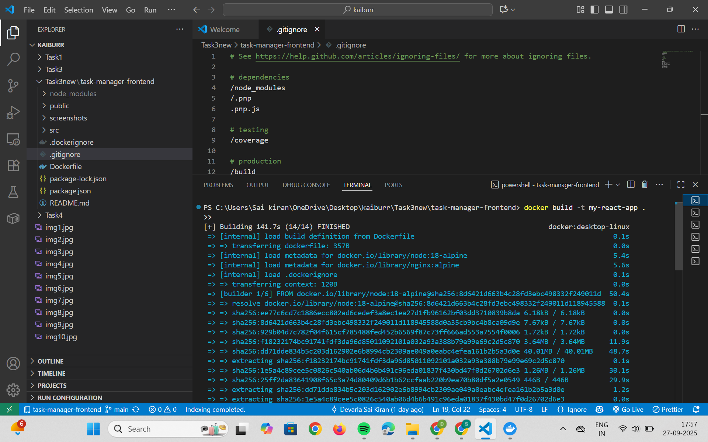
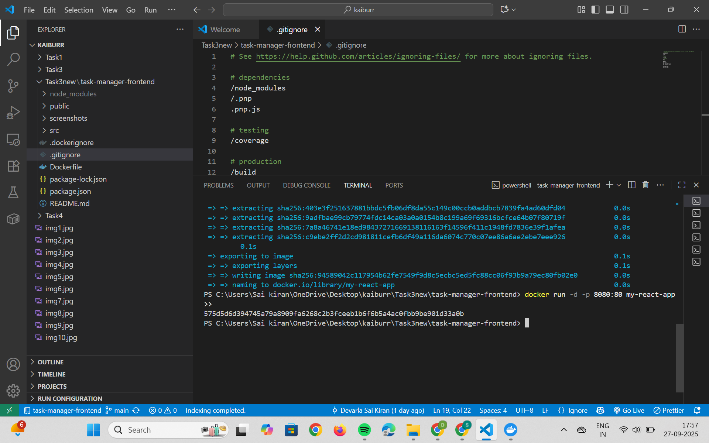
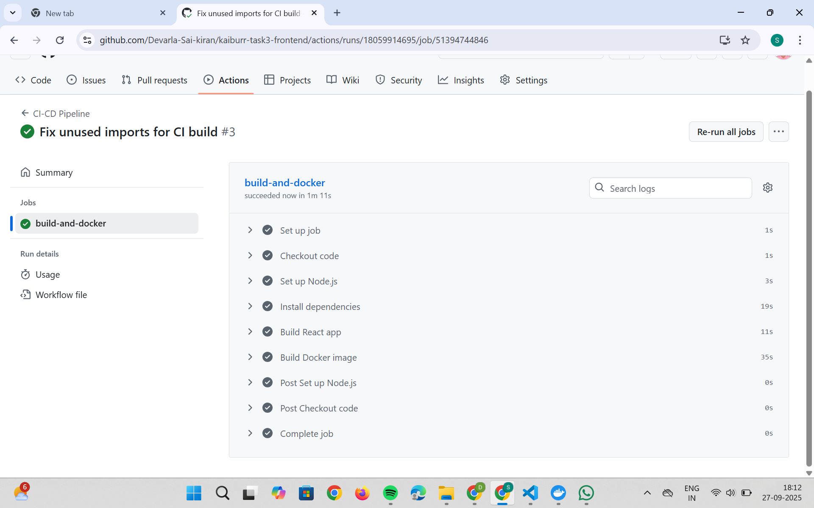
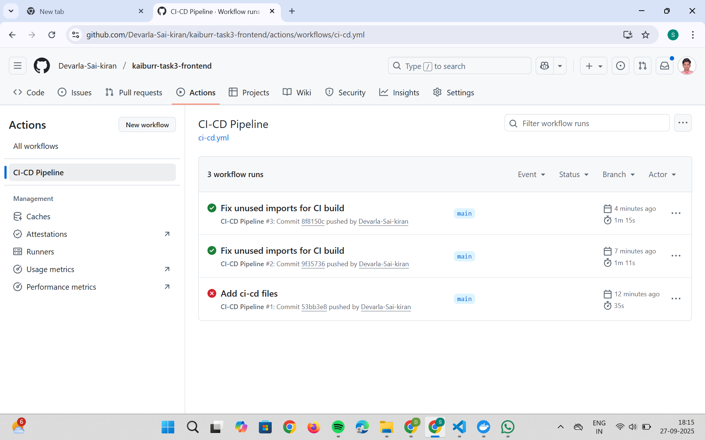

# Kaiburr Task 4 CI/CD Pipeline

**Author:** Devarla Sai Kiran  
**Date:** Sunday, September 28, 2025

This repository contains a CI/CD pipeline for automating the build and Docker image creation of the Kaiburr Task 2 frontend application. The pipeline is implemented using GitHub Actions and runs automatically on every push to the main branch.

# Pipeline Features

**Code build step:** Installs dependencies and builds the React app

**Docker build step:** Builds a Docker image for the frontend

**Automatic triggers:** Runs on every push to the main branch

# The workflow file is located at:
    .github/workflows/ci-cd.yml

# Main Steps in the Workflow
    - Checkout code from the repository

    - Set up Node.js environment

    - Install dependencies with npm install

    - Build the project with npm run build

    - Build Docker image with docker build

    - You can view the pipeline status and logs in the Actions tab of this repository.

# How to Use This Pipeline
    1. Clone the repository: https://github.com/Devarla-Sai-kiran/kaiburr-task4-ci-cd.git
        
    2. Push changes to the main branch:
        - The pipeline will run automatically.
        
    3. View results:
        - Go to the Actions tab in GitHub to see build and Docker logs.

## Screenshots

### Docker Build

### Run Imgae

### Pipeline Run in GitHub Actions

